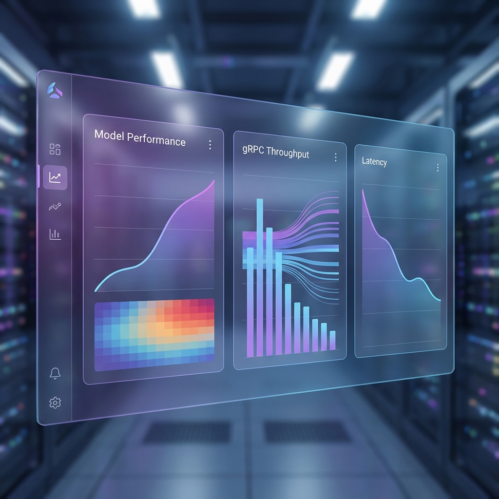
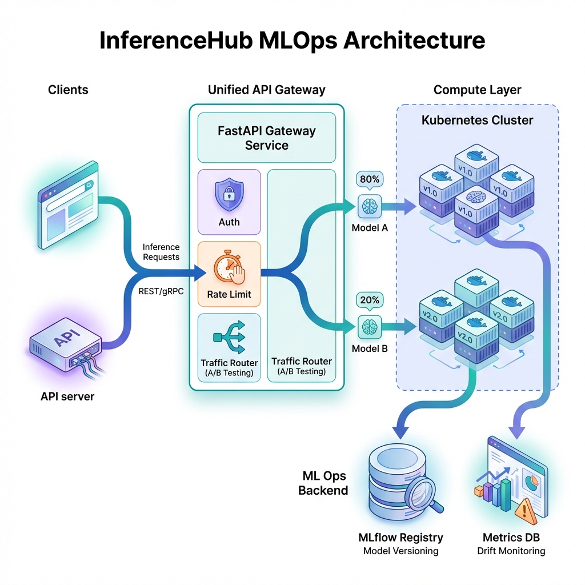
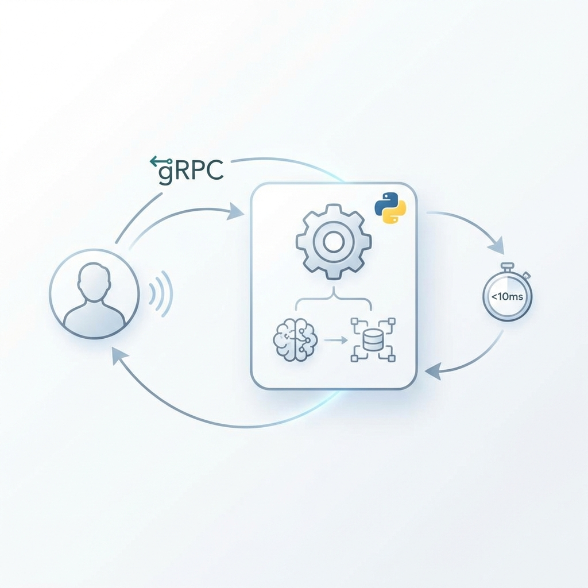

# InferenceHub


## High-Performance AI Inference Gateway with gRPC & Python

<div align="center">


</div>

**InferenceHub** is a high-performance **Microservices Pattern** for serving AI models. It decouples the application layer (Node.js) from the compute layer (Python) using **gRPC**, enabling independent scaling, strict type safety, and 10x faster serialization than standard REST APIs. This architecture is designed to protect the "Brain" (AI models) from the "Noise" (Concurrent API traffic).

---

## 🚀 Quick Start

Launch the distributed system (Gateway + Worker + Dashboard) in one command:

```bash
# Start Gateway (Node) and Service (Python)
docker-compose up --build -d
```

> **Detailed Setup**: See [GETTING_STARTED.md](./docs/GETTING_STARTED.md).

---

## 📸 Demo & Architecture

### MLOps Performance Dashboard

*Monitoring gRPC throughput and model latency with millisecond precision.*

### System Architecture

*Decoupled Gateway Pattern with Binary Protobuf transport.*

### High-Throuhgput Logic

*Client -> Node.js Gateway (Validation) -> gRPC (Strict Contract) -> Python (Inference).*

> **Deep Dive**: See [ARCHITECTURE.md](./docs/ARCHITECTURE.md) for the `.proto` definitions.

---

## ✨ Key Features

*   **⚡ binary Transport**: Uses **Protocol Buffers** via gRPC for 60% smaller payloads vs JSON.
*   **🛡️ Polyglot Architecture**: Node.js for high-concurrency I/O and Python for optimized AI compute.
*   **🧠 Strict API Contracts**: Zero "Schema Drift" thanks to shared `.proto` source-of-truth.
*   **🐳 Docker Native**: Orchestrates complex networking between C++ based gRPC runtimes.

---

## 🏗️ The Protective Journey

How a request traverses the polyglot stack:

1.  **Entry**: Client submits JSON to the Node.js Gateway.
2.  **Validate**: Node.js performs schema checks (Zod/Joi) and Auth.
3.  **Serialize**: Data is packed into a binary Protobuf buffer.
4.  **Transport**: gRPC stream transmits the buffer to the Python worker.
5.  **Compute**: Python loads the weights (PyTorch/Scikit) and executes.
6.  **Return**: Binary result is unpacked by Node and sent to the client as JSON.

---

## 📚 Documentation

| Document | Description |
| :--- | :--- |
| [**System Architecture**](./docs/ARCHITECTURE.md) | gRPC design, Sidecar patterns, and scaling logic. |
| [**Getting Started**](./docs/GETTING_STARTED.md) | Docker environment, .env, and CURL examples. |
| [**Failure Scenarios**](./docs/FAILURE_SCENARIOS.md) | gRPC Deadlines, OOM protection, and restarts. |
| [**Interview Q&A**](./docs/INTERVIEW_QA.md) | "Why decouple?", "REST vs gRPC", and "The Restaurant Analogy". |

---

## 🔧 Tech Stack

| Component | Technology | Role |
| :--- | :--- | :--- |
| **Gateway** | **Node.js (Express)** | Auth, Validation, gRPC Client. |
| **Worker** | **Python 3.9** | ML Inference (PyTorch/SK-Learn). |
| **Protocol** | **gRPC (Protobuf)** | Low-latency binary transport. |
| **Infrstructure**| **Docker Compose** | Multi-container orchestration. |

---

## 👤 Author

**Harshan Aiyappa**  
Senior Full-Stack Hybrid AI Engineer  
Voice AI • Distributed Systems • Infrastructure

[](https://kimo-nexus.vercel.app/)
[](https://github.com/Kimosabey)
[](https://linkedin.com/in/harshan-aiyappa)
[](https://x.com/HarshanAiyappa)

---

## 📝 License

This project is licensed under the MIT License - see the [LICENSE](LICENSE) file for details.
